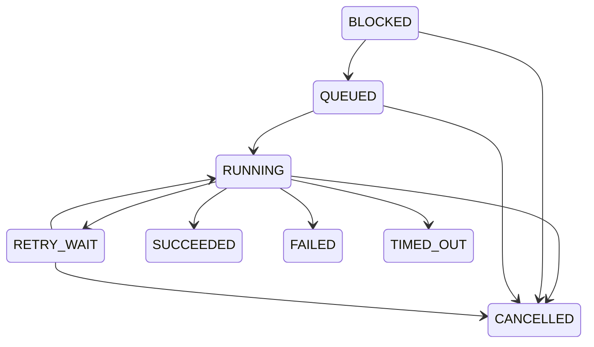

# Architecture

## Shape

Ordanis starts as a modular monolith plus independently running workers.

```text
REST clients
    |
    v
Ordanis server ---- PostgreSQL
    |
    | gRPC: register, lease, heartbeat, progress, result
    v
Java workers
```

The server is the control plane and durable scheduler. Workers are the data plane and execute user-defined handlers.

## Execution path

1. A workflow definition is validated and compiled into a DAG.
2. Starting a run creates all task-run rows in one transaction.
3. Root tasks enter `QUEUED`; dependent tasks enter `BLOCKED`.
4. A registered worker requests work; the server checks its capabilities and free slots.
5. PostgreSQL atomically leases one eligible task using `FOR UPDATE SKIP LOCKED`.
6. The worker renews the lease while executing.
7. Success unblocks children only when every dependency succeeded; their outputs are injected into the child payload.
8. An expired lease is retried or becomes terminal after retry exhaustion.

## Task states



## Core correctness choices

- PostgreSQL is the source of truth; workers hold no authoritative state.
- A lease is valid only for the matching task, worker, token, and expiry time.
- Delivery is at least once, not exactly once.
- Workflow completion is derived from persisted task states.
- Kafka and Kubernetes are not required for correctness in phase one.
